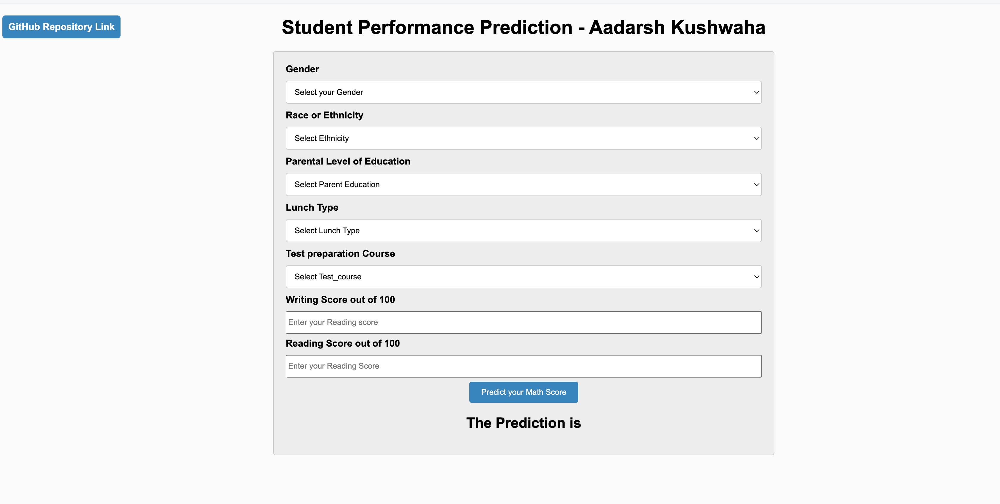
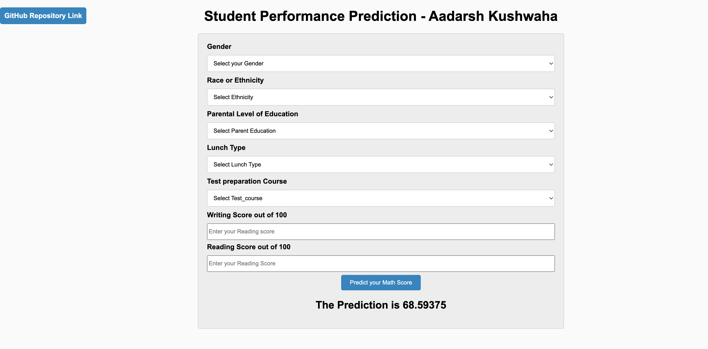

## End to End Machine Learning Project
# Student Performance Prediction
### Introduction About the Data :
**The Dataset** goal is to predict `Math Score` of students (Regression Analysis). It consists of 8 columns and 1000 rows.

It has 3 numerical features : ['math_score', 'reading_score', 'writing_score']

It has 5 categorical features : ['gender', 'race_ethnicity', 'parental_level_of_education', 'lunch', 'test_preparation_course']

There are 7 independent variable.
* `gender`: sex of students -> male/female
* `race/ethnicity`: ethnicity of students -> (Group A, B, C, D, E)
* `parental_level_of_education`: parents' final education ->(bachelor's degree,some college,master's degree,associate's degree,high school)
* `lunch`: having lunch before test (standard or free/reduced)
* `test_preparation_course`: complete or not complete before test
* `reading_score`: score obtain by student in reading
* `writing_score`: score obtain by student in writing

Target Variable:
* `math_score`: score obtain by student in math subject

**Data Source Link :** (https://www.kaggle.com/datasets/spscientist/students-performance-in-exams?datasetId=74977)
[https://www.kaggle.com/datasets/spscientist/students-performance-in-exams?datasetId=74977]

# Screenshot of UI

# Approach for the project

1. Data Ingestion :
    * In Data Ingestion phase the data is first read as csv.
    * Then the data is split into training and testing and saved as csv file.

2. Data Transformation :
    * In this phase a ColumnTransformer Pipeline is created.
    * for Numeric Variables first SimpleImputer is applied with strategy median , then Standard Scaling is performed on numeric data.
    * for Categorical Variables SimpleImputer is applied with most frequent strategy, then OneHotEncoder performed , after this data is scaled with Standard Scaler.
    * This preprocessor is saved as pickle file.

3. Model Training :
    * In this phase base model is tested . The best model found was Linear regression.
    * After this hyperparameter tuning is performed on and Linear regression is the best model.
    * This model is saved as pickle file.

4. Prediction Pipeline :
    * This pipeline converts given data into dataframe and has various functions to load pickle files and predict the final results in python.

5. Flask App creation :
    * Flask app is created with User Interface to predict the gemstone prices inside a Web Application.

# Exploratory Data Analysis Notebook

Link : [EDA Notebook](./notebook/eda_students_performance.ipynb)

# Model Training Approach Notebook

Link : [Model Training Notebook](./notebook/model_training.ipynb)

# Flask is used as a WEB API